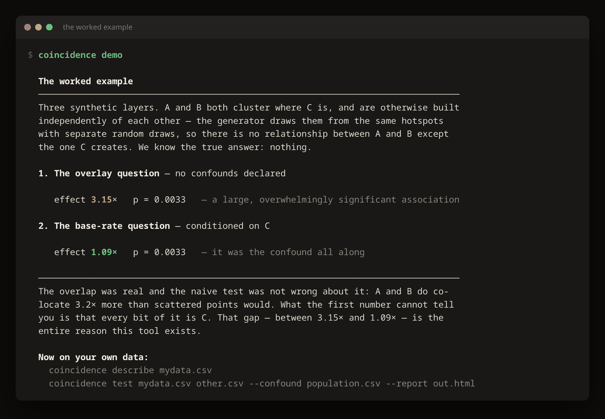
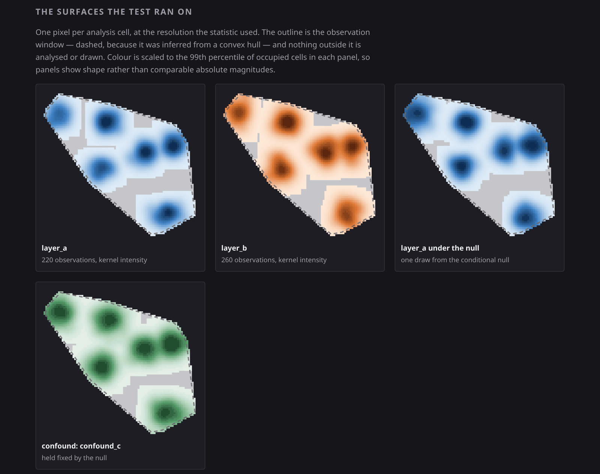
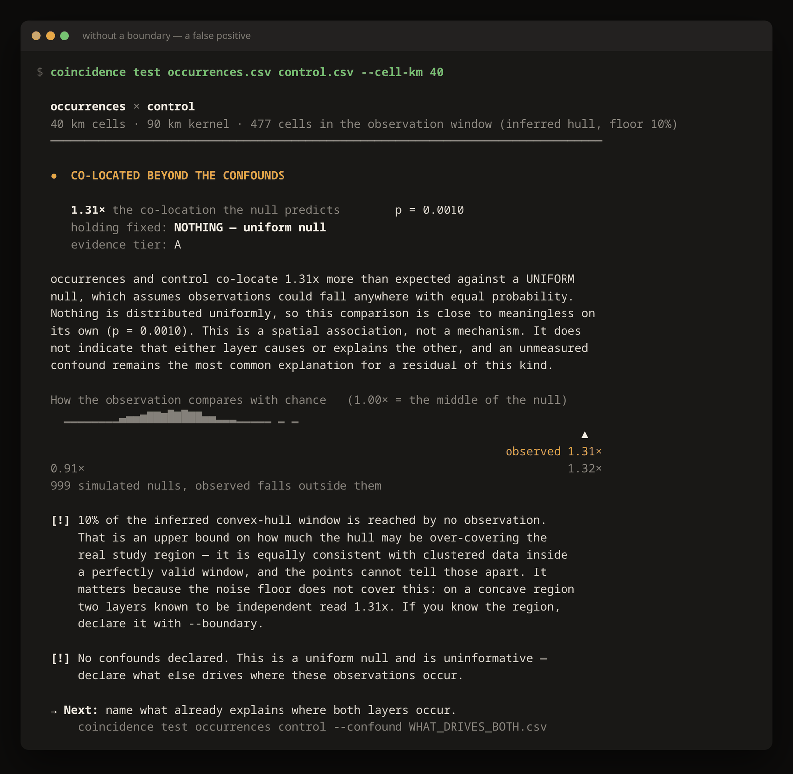

# Coincidence App

A tool for testing whether apparent spatial coincidence survives contact with base rates.

Bring any two located datasets and the things you think already explain where they occur.
It answers one question: **does the overlap exceed what those confounds already predict?**

Pure Python standard library. No install, no dependencies, no network, no build step.

**[Start with the ten-minute tutorial →](https://9x25dillon.github.io/coincidense_app/)**

## Try it in thirty seconds

```bash
python3 -m coincidence demo
```



Two synthetic layers that both cluster where a third thing is, and are otherwise
unrelated to each other. There is no relationship between them; the generator built them
independently. The gap between those two numbers is the entire reason this project
exists.

Same thing on files, with a visual report:

```bash
python3 examples/make_synthetic.py
python3 -m coincidence test examples/layer_a.csv examples/layer_b.csv \
    --confound examples/confound_c.csv --bins 10 --sensitivity --report finding.html
```

## The problem it exists to solve

Put three evocative map layers on top of each other and the eye will find a pattern. It
essentially always will. Deep cave systems, tribal lands, and clusters of missing-persons
cases all concentrate in the same kind of country: rugged, sparsely populated, hard to
search, unevenly policed, inconsistently reported. Overlay them and you get overlap. The
overlap is real. What it *means* is a separate question, and the map alone cannot answer
it.

Most tools stop at the overlay — they render the suggestion and let the viewer supply the
inference. This one goes one step further: it states what the overlap would look like
under the null, and shows whether the observed overlap exceeds it.

Not to debunk, and not to confirm. To make the claim *testable* and then actually test it.

## Bring your own data

CSV, TSV, JSON, JSON Lines, GeoJSON. Coordinate columns are auto-detected and can be
named explicitly. Any subject matter — the machinery does not care whether your points
are cave entrances, UFO sightings, cell towers, cancer cases, or bird nests. The
analytical question is identical.

```bash
python3 -m coincidence describe mydata.csv
python3 -m coincidence test sightings.csv towers.csv --confound population.csv
python3 -m coincidence test a.csv b.csv --confound pop.csv --report finding.html
```

Column names are auto-detected, overridable globally (`--lat`, `--lon`) or per layer
(`--lat-a`, `--lon-b`, `--weight-c`). Unreadable columns produce an error that shows
what the file actually contains, with a sample value from each column, rather than a
list of names.

Full input contract, output interpretation, and limitations: [`docs/ANY_DATA.md`](docs/ANY_DATA.md).

## What makes it different

**Confounds are the input, not an afterthought.** Without them the engine runs a uniform
null and tells you the answer is close to meaningless. Nothing is uniformly distributed;
against that null nearly everything looks significant.

**Effect size gates the verdict, not the p-value.** Monte Carlo nulls tighten with more
simulations until a 2% deviation reads as p < 0.01. A result needs a 10% effect *and*
p < 0.05 before the tool will call it anything.

**Scale is reported with the number.** Two layers coupled at 5 km read as 4.9x under a
25 km kernel and 1.1x under a 200 km kernel. Both are correct answers to different
questions. `--sensitivity` sweeps grid resolution and bandwidth so one parameter choice
cannot quietly decide your result.

**The null is drawn, not asserted.** The terminal prints the simulated null as a
distribution with the observation marked on it, in the same units as the headline ratio.
`--report` writes a self-contained HTML page carrying the analysis surfaces themselves —
layer A, layer B, and *one draw from the null beside them*.



Look at the third panel. That is layer A as chance would have arranged it, given the
confound. When it is hard to tell from the real thing beside it, you can see why the
number came back near 1 instead of taking the tool's word for it.

**Negative results are printed.** "No association beyond chance" gets the same banner,
the same colour weight, and the same space as a positive, because it is equally a
finding. A UI that renders it as a failure would undo in styling what the engine is for.

**The answer does not depend on argument order.** The null resamples one layer and holds
the other fixed, which is a different test depending on which one moves. Both directions
are run and the conservative one is reported.

**The study region is yours to declare.** `--boundary region.geojson` replaces the
inferred convex hull with the real thing. This matters more than it sounds — below are
two layers scattered *independently* inside a crescent-shaped survey area, so the true
answer is nothing:

| over 8 trials | inferred convex hull | declared boundary |
|---|---|---|
| mean effect | **1.307×** — a false positive | **1.005×** |
| worst deviation | 33.4% | 1.9% |



A confident false positive at three times the noise floor meant to suppress it.
Coastlines, valley floors and river corridors are all that shape. The tool reports how
much of an inferred window no observation reaches — an upper bound on the over-coverage,
not a claim about your geometry, because clustering and concavity are not separable from
the points alone. Declaring a boundary also lowers the floor from 10% to 4%.

**Provenance is a type.** Every layer carries an evidence tier through ingest, analysis,
and output. Data loads as *uncertain* until you assert otherwise — see
[`docs/EVIDENCE_STANDARDS.md`](docs/EVIDENCE_STANDARDS.md).

**Results are shareable and re-runnable.** `--export` writes a bundle with the inputs,
parameters, null specification, and seed. Someone else can re-run it and disagree
precisely, rather than trading screenshots.

## Tests

```bash
python3 -m unittest discover -s tests -v
```

76 tests, including the executable form of the project's central claim: a confounded
association must collapse when conditioned, a genuine one must survive, and two
independent layers must come back as unrelated. Several were written after the
implementation got those wrong — eight defects so far, each of which produced confident
false positives or false dismissals, all written up in
[`docs/METHODOLOGY.md`](docs/METHODOLOGY.md#what-went-wrong-on-the-way-here) rather than
quietly fixed.

## The originating case study

The three-layer North America map this started from — deepest cave systems, tribal
lands, and Missing 411 case clusters — remains the worked example the design documents
are written against. The data has not been ingested; every source in
[`data/sources.yaml`](data/sources.yaml) is marked `verified: false` until a human opens
it and confirms custodian, vintage, license, and access path.

That case study is also why the ethics constraints are structural rather than advisory:
withheld cave entrances stay withheld, tribal boundary categories stay legally distinct,
and no missing person appears on a map by name. See [`docs/ETHICS.md`](docs/ETHICS.md).

## Repository layout

```
coincidence/                the engine
  loading.py                any format in — CSV, JSON, JSONL, GeoJSON
  boundary.py               declared study region: GeoJSON polygons, holes included
  projection.py             equal-area projection (Albers, cylindrical)
  grid.py                   analysis grid, kernel smoothing, observation window
  nulls.py                  stratified surrogate generation
  analysis.py               co-location statistic, Monte Carlo testing, reporting
  console.py                terminal presentation, null plot
  report.py                 self-contained HTML report with the analysis surfaces
  cli.py                    demo / describe / test
docs/
  index.html                the ten-minute tutorial (served at GitHub Pages)
  images/                   screenshots, all captured from real output
  ANY_DATA.md               input contract, reading results, limitations
  EVIDENCE_STANDARDS.md     tiering and how it's enforced
  METHODOLOGY.md            confounds, null construction, and what went wrong
  DATA_SOURCES.md           narrative register of the case-study datasets
  ETHICS.md                 cave locations, tribal data sovereignty, victim dignity
  ROADMAP.md                phase plan
data/sources.yaml           machine-readable source manifest
examples/                   synthetic worked example
tests/                      the suite
prompts/                    the originating specification
VISION.md                   ambition and trajectory
```

## License

MIT — see [`LICENSE`](LICENSE). Use it, fork it, take the method somewhere else. The
point of a shared null model is that a second person can re-run your analysis, swap the
confound set, and show you precisely where you went wrong; that only works if they are
allowed to.

## Status

The engine works and is tested. The North America case-study data is not yet ingested.
See [`docs/ROADMAP.md`](docs/ROADMAP.md).
